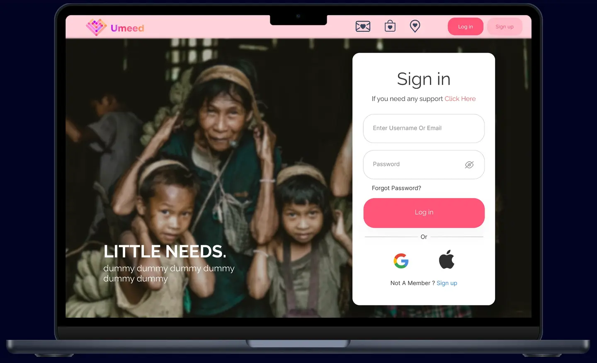
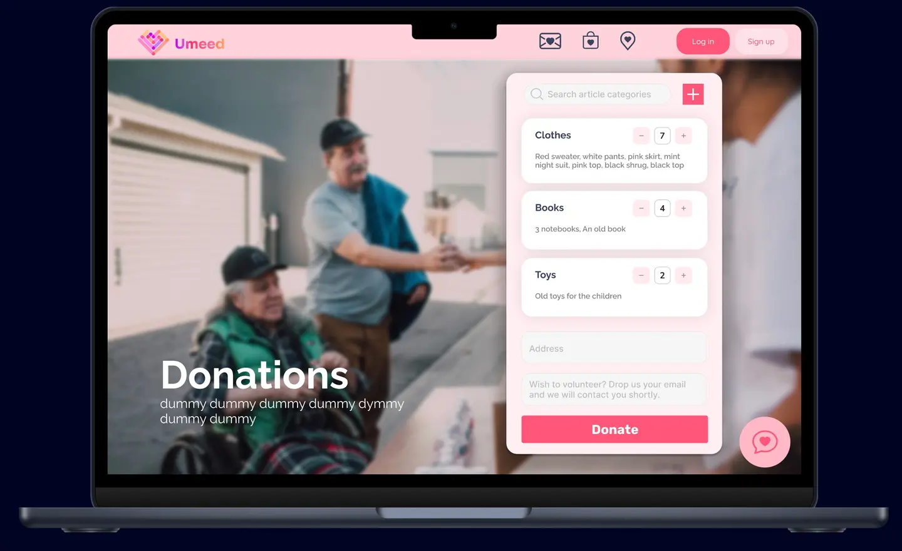
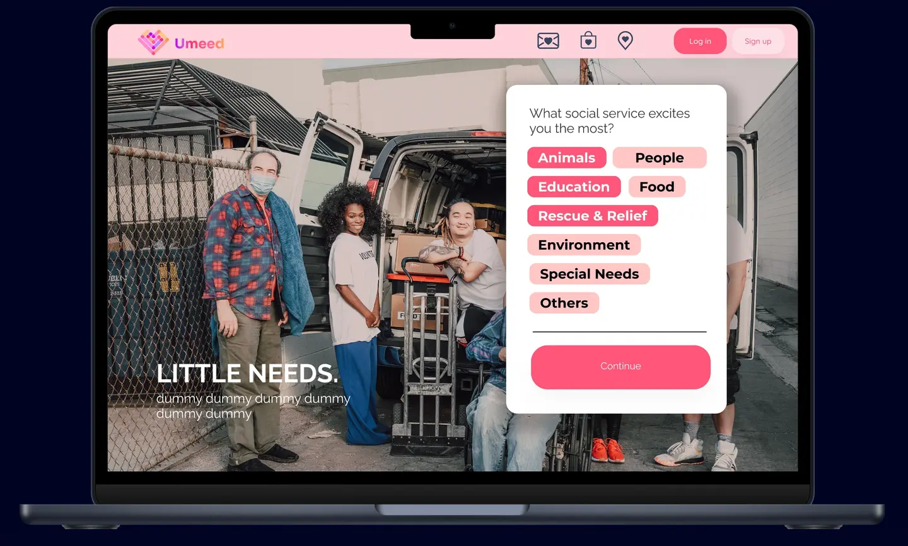

# Umeed - Empowering NGOs and Building Communities
Umeed is a versatile platform that serves the dual purpose of empowering Non-Governmental Organizations (NGOs) and fostering a vibrant community. It provides NGOs with the tools to recruit volunteers, raise funds, and manage their operations efficiently. Additionally, it offers a social platform built using React for web and mobile, connecting individuals with a shared commitment to making the world a better place.
- Umeed literally translates to hope in Hindi. "Ek umeed, badlaav ki ore." (One hope, towards change.)
  

## Table of Contents

- [Umeed - Empowering NGOs and Building Communities](#umeed---empowering-ngos-and-building-communities)
  - [Table of Contents](#table-of-contents)
  - [Introduction](#introduction)
  - [Demo](#demo)
  - [Features](#features)
    - [For NGOs:](#for-ngos)
    - [For Individuals:](#for-individuals)
  - [How it Works](#how-it-works)
  - [Tech Stack](#tech-stack)
  - [Usage](#usage)
  - [Contributing](#contributing)
  - [License](#license)
## Introduction
- Umeed is a web application that aims to connect donors and NGOs. It is a platform where NGOs can register themselves and create a profile. Donors can view the profiles of the NGOs and donate to them. 
- It makes the process of donating to NGOs easier and more transparent. It also helps NGOs to reach out to more people and get the help they need.
- Umeed aims to solve the targeted Sustainable Development Goals (SDGs) by the United Nations. The SDGs are a universal call to action to end poverty, quality education, reduce inequality, and protect the planet. Umeed aims to help NGOs working towards these goals by providing them with the platform they need.
- NGOs are unorganized and scattered across the country. There is a lack of awarness about their work. There is a lack of transperancy in the process and no platform to connect donors and NGOs. Umeed aims to solve these problems.

## Demo
[Presentation](https://drive.google.com/file/d/1ERAqFOgLcwvEYW1jNJTxl2zJamTGRnSp/view)

## Features

### For NGOs:

- **Volunteer Recruitment**: NGOs can create volunteer opportunities, reaching a broader audience of potential volunteers.
- **Fundraising**: Umeed offers a secure platform for NGOs to raise funds, manage donations, and track financial progress.
- **Resource Management**: NGOs can efficiently manage their resources, including volunteers, events, and projects.
- **Real-time Reporting**: Detailed reports provide insights into volunteer engagement, fundraising success, and impact.

### For Individuals:

- **Community Building**: Umeed fosters a supportive and collaborative community of individuals passionate about social causes.
- **Social Networking**: Connect with like-minded people, join groups, and participate in discussions.
- **Volunteer Opportunities**: Discover volunteer opportunities that align with your interests and skills.
- **Donation and Support**: Contribute to causes you care about through secure and transparent donation mechanisms.

## How it Works

Umeed is built on React, providing a seamless web and mobile experience for both NGOs and individuals. Key functionalities include:

1. **User Registration and Profiles**: Users can create and manage profiles, including their interests, skills, and causes they support.

2. **Volunteer Opportunities**: NGOs can post volunteer opportunities, and individuals can discover and apply for these roles.

3. **Fundraising Campaigns**: NGOs can create fundraising campaigns with detailed information and progress tracking.

4. **Community Engagement**: Users can join groups, participate in discussions, and connect with others who share their passion.

5. **Secure Donations**: Umeed ensures secure and transparent donation processes for fundraising campaigns.

## Tech Stack
- Frontend: HTML, CSS, JavaScript, Tailwind CSS, React, Redux
- Backend: Node.js, Express.js
- Database: MongoDB
- Hosting: Hostinger VPS
- Version Control: Git and GitHub

## Usage

Umeed is designed to be user-friendly and intuitive. NGO administrators can efficiently manage their operations, and individuals can seamlessly navigate the platform to volunteer, donate, and connect with their community.

## Contributing

Contributions to Umeed are welcome! If you have ideas for improvements, bug reports, or want to contribute new features, please check out the [contribution guidelines](CONTRIBUTING.md).

## License

Umeed is open-source software licensed under the [MIT License](LICENSE). You are free to use, modify, and distribute it according to the terms of this license.

---

**Disclaimer**: Umeed is a platform for social good, but users should exercise caution and verify the legitimacy of NGOs and campaigns before volunteering or making donations.

